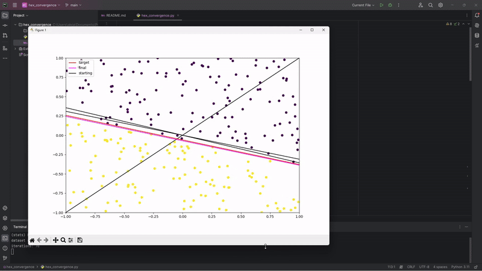

## Visual linear convergence through PLA with relative line colours


For a randomly generated target function and a bidimensional dataset of 250 points, we label the points relative to the target line (either +1 or -1) and use a Perceptron Learning Algorithm (PLA) to converge towards the target funciton.

The PLA used in this script uses weights in order to find the best threshold. The weights are updated following:

$$ w(t+1) = w(t) + y(t)x(t) $$

$$ y(t) \ne sign(w^T(t)x(t)) $$

We then display the path to convergence by assigning a unique hex code colour to each line iteration, displaying it with matplotlib.

Target line is coloured red, the starting line coloured black, and each line progresses from black towards a light green faster or slower depending on the number of iterations it took for the algorithm to converge.



## Dependencies
[Numpy](https://numpy.org/) for random, array and labeling operations.

[Matplotlib](https://matplotlib.org/) for plot visualization.

## Compile and run

```bash
# Clone repository
$ git clone https://github.com/11acc/hex_convergence.git

# If needed
$ pip install numpy matplotlib

# Execute script (Windows)
$ python.exe .\hex_convergence.py
```

## Contributing/License

Fork it, modify it, push it, eat it, summon a duck god with it. Whatever resonable day-to-day activity you prefer ( •ᴗ•)b
